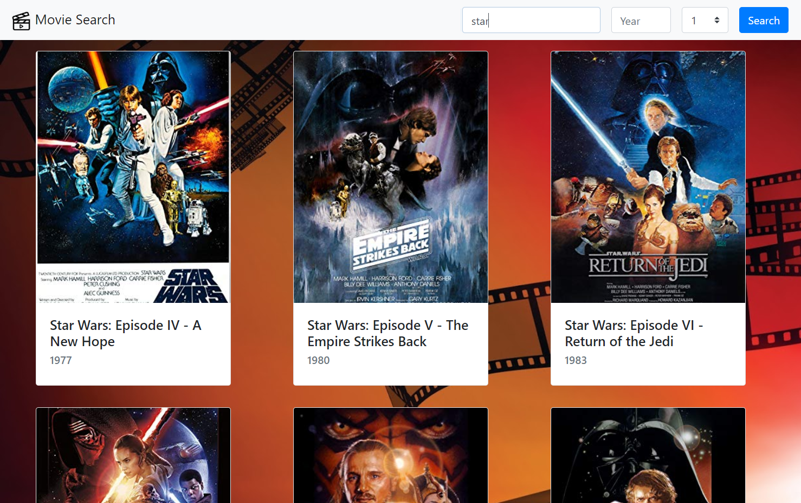

# Movie API Search (omdb-search)

## Functionality 

Searches movie data using the OMDB API. Allows the user to search by movie title and (optionally) year. The data is returned a page at a time and the user is able to navigate through the pages as required.

## Learning

This project implements calling an external API (OMDB) to retrieve data and display it to the user. This includes both text and image data. A placeholder image is used for where the API does not return an image URL for a given movie.

I used Bootstrap for the first time in this project to style the page - navbar, form (text, combobox, button) and grid of returned movie cards.

## Screenshot

